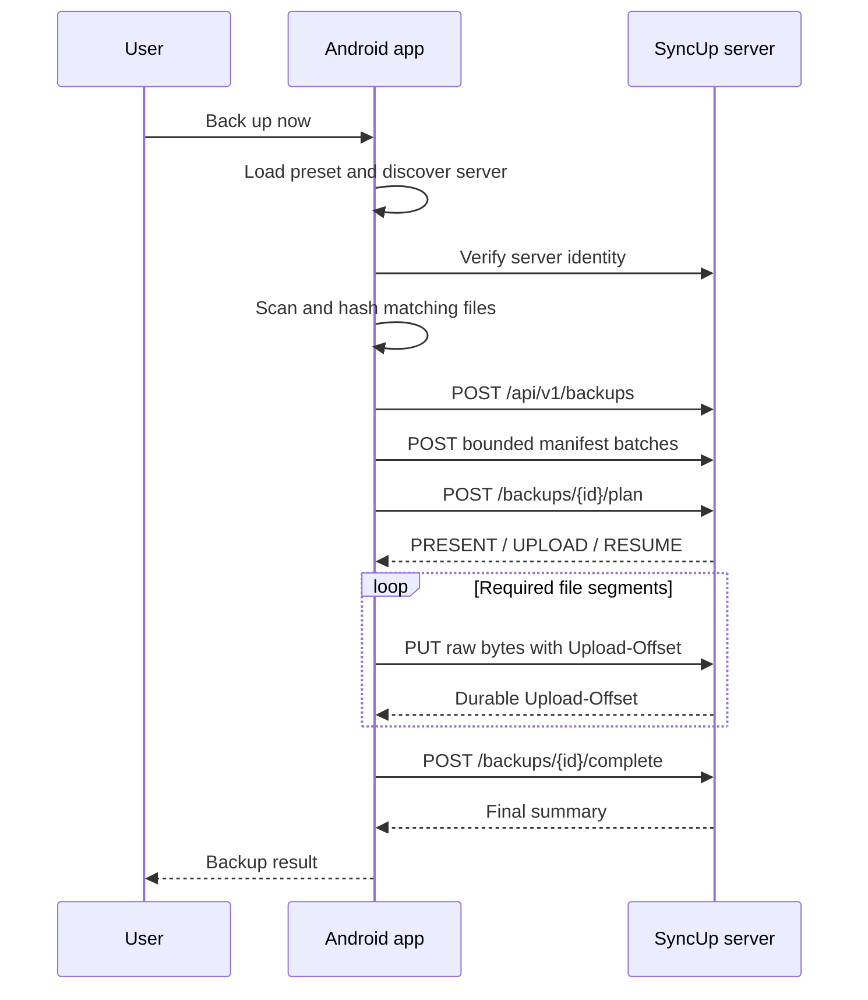

# SyncUp Android Client — Design and Implementation Plan

## 1. Purpose

The Android client lets a user select local photos, videos, and files, back them up to one SyncUp server on the same private network, and restore backed-up files to the device.

## Implementation Status — 2026-07-03

### Implemented

- Java/XML Android application shell with Material 3 and edge-to-edge layouts
- Home screen with searching, connected, and unavailable server states
- UDP broadcast discovery matching the implemented `SYNCUP_DISCOVER` server contract
- Verification through `GET /api/v1/server` with API/server identity checks
- Cached server reconnect before UDP fallback
- Manual server address fallback
- OkHttp client with bounded connection/read/call timeouts
- Retry controls and connected server name/base URL display
- Default-preset summary and navigation to backup configuration
- Backup configuration for:
  - Preset name
  - Phone photo/video library source
  - Persisted read access to one custom SAF folder
  - Images, videos, and documents
  - Today, yesterday, last 7 days, custom inclusive range, or all dates
- Validation for missing name, source, type, folder-dependent documents, and invalid custom dates
- Room `backup_presets` table, DAO, singleton database, and asynchronous repository
- Automatic creation of a useful initial default preset
- Device-timezone date calculation producing `[fromInclusive, toExclusive)` UTC instants
- Unit tests for date-window and preset-validation rules
- Instrumentation test source for Room default-preset persistence

### Verified

- `testDebugUnitTest`
- `assembleDebug`
- `assembleDebugAndroidTest`
- `lintDebug` with zero errors
- Emulator runtime: unavailable/retry/manual-address UI
- Emulator runtime: manual connection to `10.0.2.2:8500`
- Emulator runtime: cached reconnect after app restart

The existing Room instrumentation test was not run as part of the discovery change.

### Partially implemented

- Media permissions are declared, but runtime permission requests and partial-library access handling are not implemented.
- The user can select and persist a custom folder, but recursive folder enumeration is not implemented.
- The user can configure media types and dates, but no local file scan/preview is produced yet.
- Server discovery is complete, but the backup action remains disabled until local scanning and upload are implemented.

### Still planned

- `MediaStore` and SAF file scanners with deterministic filtering
- File-list preview and scan error reporting
- Manifest batching and backup planning
- Foreground backup execution, progress, cancellation, retry, and resume
- Streaming upload and HTTP Range restore
- Restore browser and destination handling
- Backup-run/local-file Room tables
- Runtime UI, integration, failure-injection, and performance testing

## 2. Version 1 Scope

### In scope

- Java Android app (`syncup.client.client`)
- Discover one server automatically on the local network
- Allow manual server IP as a recovery path
- Select media or folders, file types, and date range
- Save one default backup configuration
- Start backup manually
- Display discovery, scan, transfer, success, and failure states
- Retry failed files
- List and restore files from the connected server

### Deferred

- Scheduled or Wi-Fi-triggered backup
- Multiple-server selection
- Laptop client
- File version history
- Internet access and cloud backup

## 3. User Experience

### 3.1 Home

The home screen shows:

- Server state: `Searching`, `Connected`, `Not found`, or `Connection lost`
- Connected server name
- Active preset summary
- Primary **Back up now** action
- Last successful backup time and result
- Navigation to configuration and restore

If no server is found, show **Try again** and **Enter IP manually**. Starting a backup must never silently wait for discovery.

### 3.2 Backup configuration

The user can configure:

- Sources:
  - Photos and videos through `MediaStore`
  - Downloads and custom folders through the Storage Access Framework (SAF)
- File types: images, videos, documents, all, or custom extensions
- Dates: today, yesterday, last 7 days, all, or a custom inclusive range
- Whether this configuration is the default

Persist SAF URI permissions so a selected folder remains available after an app restart.

### 3.3 Backup progress

Show:

- Current phase: scanning, comparing, uploading, or verifying
- Files completed / total
- Bytes transferred / total
- Current file
- Transfer rate
- Cancel action

The user may leave the screen while a transfer runs. Android should keep the operation visible with a foreground notification when required.

### 3.4 Restore

The restore flow:

1. Request a paginated list of server files.
2. Filter by date and file type.
3. Select files.
4. Choose a destination.
5. Download and verify them.
6. Add restored media through `MediaStore` so it appears in gallery apps.

## 4. Client Architecture

Use a layered Java structure with UI code isolated from Android storage and network details.

```text
syncup.client.client
├── ui
│   ├── home
│   ├── config
│   ├── backup
│   └── restore
├── domain
│   ├── model
│   └── usecase
├── data
│   ├── local
│   ├── media
│   └── repository
├── network
│   ├── discovery
│   ├── api
│   └── transfer
└── worker
```

### Component responsibilities

| Component | Responsibility |
|---|---|
| `ServerDiscoveryRepository` | Verify cached/manual servers, broadcast discovery, cache identity, and report connection state |
| `SyncUpApiClient` | Call versioned JSON endpoints and map HTTP/Problem Details responses |
| `FileScanner` | Convert `MediaStore` and SAF results into a common file descriptor |
| `ManifestBuilder` | Apply source, type, and date filters and build the manifest |
| `TransferCoordinator` | Negotiate backup plans and schedule bounded HTTP upload/download work |
| `UploadRequestBody` | Stream a segment from `ContentResolver` through OkHttp without buffering the file |
| `DownloadWriter` | Stream full/range responses to a temporary destination and verify content |
| `BackupRepository` | Present one API to UI/use cases and coordinate local/network sources |
| `Room` database | Store presets, server cache, backup runs, and per-file status |
| Foreground worker/service | Keep an active user-started transfer alive and visible |

UI classes must not open sockets, make HTTP calls, query `MediaStore`, or directly manage worker threads.

Use configured OkHttp clients for SyncUp API traffic. Discovery verification currently uses short bounded timeouts. File transfers will use the same verified server origin with longer read/write timeouts than small JSON requests.

## 5. Local Data Model

### `backup_presets`

| Field | Meaning |
|---|---|
| `id` | Local primary key |
| `name` | Display name |
| `sources_json` | Media categories and persisted SAF URIs |
| `file_types_json` | Selected categories/extensions |
| `date_mode` | `TODAY`, `YESTERDAY`, `LAST_N_DAYS`, `CUSTOM_RANGE`, or `ALL` |
| `date_from`, `date_to` | Optional inclusive custom range |
| `is_default` | Drives one-tap backup |

### `backup_runs`

| Field | Meaning |
|---|---|
| `run_id` | Server-issued backup run UUID |
| `preset_id` | Preset used for the run |
| `server_id` | Destination server |
| `state` | Preparing, transferring, completed, cancelled, or failed |
| `file_count`, `byte_count` | Planned totals |
| `files_completed`, `bytes_completed` | Progress |
| `started_at`, `completed_at` | Timestamps |
| `error_code`, `error_message` | Last terminal error |

### `local_files`

Track stable content URI, display name, relative path, size, modified time, checksum when known, last run, and server file ID. This cache improves subsequent scans, but the server remains authoritative for whether content is safely backed up.

## 6. File Selection Rules

- Use `MediaStore` for shared photos and videos.
- Use SAF document tree URIs for user-selected folders.
- Never depend on raw filesystem paths being available.
- Define custom date ranges as inclusive in the device timezone, then send the equivalent `[fromInclusive, toExclusive)` UTC instants to the API.
- Treat `(content URI, size, modified time)` as a scan cache key only.
- Compute SHA-256 before upload in version 1. Hashing can later be pipelined with transfer if profiling shows it is a bottleneck.
- Stream from `ContentResolver`; do not load complete files into memory.
- A file that becomes unavailable during scanning is skipped with a visible reason rather than failing the whole run.

## 7. Backup Flow



### State machine

```text
IDLE
  → DISCOVERING
  → AUTHENTICATING
  → SCANNING
  → NEGOTIATING
  → TRANSFERRING
  → VERIFYING
  → COMPLETED
```

Any active state can move to `FAILED` or `CANCELLED`. A retry reconnects through HTTP, reads the durable backup/transfer state, and continues from the server's authoritative upload offset.

## 8. Reliability and Performance

- Use OkHttp for JSON and raw byte-stream requests; do not introduce a custom TCP protocol.
- Start with one HTTP upload at a time and bounded segments for the first vertical slice.
- Query the server transfer state before resuming and send the exact `Upload-Offset`.
- Use raw `application/octet-stream`, not multipart.
- Use HTTP `Range` for interrupted downloads.
- Add bounded cross-file parallelism only after measuring the baseline.
- Stream from `ContentResolver` with reusable buffers; never materialize complete files in memory.
- Reuse HTTP connections.
- Throttle progress events before sending them to the UI.
- Use network, wake, and notification behavior appropriate for an explicit long-running user action.
- Stop cleanly on Wi-Fi loss and retain enough run state to retry.
- Never mark a file complete locally until the server acknowledges checksum verification and atomic commit.
- Cancellation cancels active OkHttp calls, stops new work, and asks the server to cancel the run; partial files remain subject to server resume/retention policy.
- Automatic retries are limited to idempotent control requests and segments whose durable offset is confirmed.

## 9. Trusted-LAN Constraints

- Version 1 has no pairing, authentication, authorization, or TLS.
- Connect only to the discovered or manually verified SyncUp server origin.
- Do not follow redirects to another origin.
- Do not log filenames, folder names, or file bytes in release builds.
- Reject discovery responses with a mismatched request ID, server ID, or API version.
- Use the app only on a trusted private LAN; authentication and transport encryption are future upgrades.

## 10. Error States

The UI must distinguish:

- Server not found
- Permission revoked for a source
- Source file disappeared
- Insufficient space on server or device
- Network interrupted
- Checksum mismatch
- API/discovery version mismatch
- Upload offset conflict
- Server busy or rate limited
- Partial success

Map the server's HTTP status, stable Problem Details `code`, and `retryable` flag into these states. Human-readable server text is display context, not application control flow. Each UI error should state whether retrying is safe and whether user action is required.

## 11. Client Delivery Slices

### C1 — App skeleton and configuration

- [x] Home and configuration screens
- [x] Preset persistence
- [x] SAF folder selection and persisted grant
- [ ] `MediaStore` and SAF content scanning
- [ ] Runtime media-permission flow
- [x] Unit tests for date-window and preset-validation rules
- [ ] Unit tests for scanned file-type/extension filtering

**Done when:** a saved preset produces a deterministic local file list.

### C2 — Server discovery and connection

- [x] UDP broadcast discovery
- [x] Cached/manual address fallback
- [x] `GET /api/v1/server` identity verification
- [x] Searching, connected, unavailable, and retry UI states

**Done when:** the app reconnects to a verified local server after restart.

### C3 — First complete backup

- [ ] Manifest creation
- [ ] Versioned backup/manifest HTTP calls
- [ ] Single streamed HTTP upload
- [ ] Progress and cancellation
- [ ] Durable offset and committed-state handling

**Done when:** selected files arrive intact and a repeated backup sends no committed files.

### C4 — Restore

- [ ] Server file browser
- [ ] Selection and destination
- [ ] Full/range HTTP download
- [ ] Verified `MediaStore` insertion

**Done when:** a backed-up photo can be restored and opened on the device.

### C5 — Resilience and speed

- [ ] Resume interrupted files
- [ ] HTTP/idempotency retry policy
- [ ] Bounded parallel file transfers
- [ ] Performance measurement on representative large videos

**Done when:** an interrupted large-file backup resumes from the server's durable offset and an interrupted restore resumes with HTTP Range.

## 12. Client Test Plan

- Unit: preset validation, date boundaries, extension matching, manifest disposition mapping, offset handling, state transitions
- Instrumented: `MediaStore` query, SAF permission persistence, Room migrations, restored media visibility
- HTTP contract: DTO fixtures, Problem Details mapping, idempotency, upload offset conflict, range download
- Integration: discovery, upload, reconnect/resume, duplicate backup, restore
- Failure injection: Wi-Fi loss, process death, server restart, full server disk, truncated segment, checksum failure
- Performance: total throughput, hashing time, UI responsiveness, memory, and battery impact

## 13. Client Open Decisions

- Java UI with XML layouts is assumed to match the existing project.
- Decide whether active transfer execution is implemented with WorkManager plus foreground mode or a dedicated foreground service after a small lifecycle prototype.
- Decide the initial maximum manifest page/batch size after testing a large photo library.
- Align OkHttp timeout and connection-pool configuration with measured server behavior.
