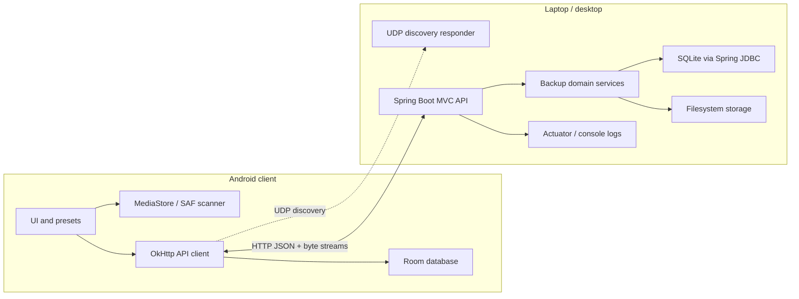
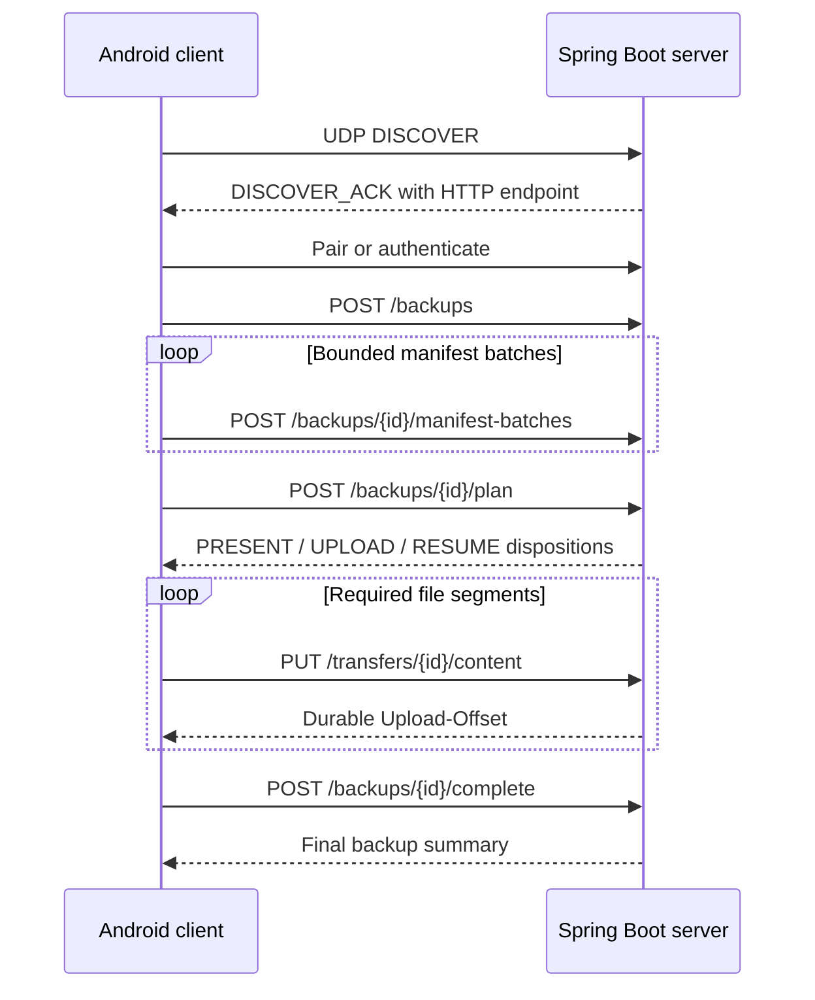

# SyncUp LAN Backup System — Shared Technical Design

## 1. Document Map

The design is split by ownership so client and server can be planned and implemented independently.

| Document | Owns |
|---|---|
| [backup-prd.md](backup-prd.md) | Product goals and user requirements |
| [android-client-design.md](android-client-design.md) | Android UX, storage access, local state, and client implementation |
| [https://github.com/nee1sharma/syncup-server](server-design.md) | Spring Boot server, metadata, disk storage, security, and operations |
| This document | System boundaries, HTTP contract, cross-component decisions, and delivery order |

When documents disagree, the shared contract in this document wins. Client-only and server-only details remain in their respective documents.

## 2. System Scope

SyncUp backs up photos, videos, and files from an Android device to a laptop or desktop on the same private Wi-Fi/LAN.

The first-release workflow is:

1. Start the Spring Boot server.
2. Open the Android app.
3. The app discovers and pairs with the server.
4. The user chooses what to back up and taps **Back up now**.
5. The app compares its local manifest with the server and uploads only missing content.
6. The user can later browse and restore those files.

### Version 1 goals

- Private-network operation without internet or cloud storage
- Java Android client
- Java Spring Boot server distributed as an executable JAR
- Automatic discovery of one server
- Source, file-type, and date filters
- Saved default configuration
- Manual incremental backup
- Basic restore
- Safe, resumable, high-throughput transfer of large media
- Pairing, authentication, integrity verification, and bounded resource use

### Deferred

- Multi-server selection
- Scheduled or network-triggered backups
- Laptop as a backup source
- Internet access
- Transport and at-rest encryption
- File versioning
- Cross-device physical deduplication

## 3. Architecture



The system uses two transports:

- **UDP discovery:** a small request/response exchange used only to find the server.
- **HTTP API:** versioned JSON endpoints for control operations and raw byte-stream endpoints for file transfer.

There is no custom control socket or custom binary framing protocol. HTTP supplies framing, persistent connections, standard authentication headers, range downloads, limits, and mature Android/Spring tooling.

## 4. Technology Decisions

| Concern | Version 1 decision |
|---|---|
| Server runtime | Spring Boot 4.1, Java 21 LTS |
| Server web stack | Spring MVC with embedded Tomcat |
| Android HTTP client | OkHttp |
| Discovery | UDP request/response on a known port |
| Control format | JSON over versioned REST endpoints |
| Upload format | Raw `application/octet-stream` request body |
| Download format | Raw response body with HTTP Range support |
| Authentication | Pairing PIN followed by bearer device token |
| Server metadata | SQLite through Spring JDBC `JdbcClient` |
| Schema migration | Versioned SQL migrations |
| Android metadata | Room |
| Integrity | SHA-256 complete-file verification |
| Incremental backup | Server compares `(deviceId, sha256, sizeBytes)` with committed files |
| Resume authority | Server reports accepted upload offset; downloads use byte ranges |
| Commit rule | Verify size/hash and atomically move before marking committed |
| Concurrency | Begin with one transfer; add bounded parallel HTTP requests after measurement |
| Observability | Spring Boot Actuator health/metrics plus structured logs |
| Compatibility | `/api/v1` URL namespace and discovery protocol version |

Spring WebFlux is intentionally not selected for version 1. The expected client count is low, while SQLite and filesystem operations are blocking. Spring MVC keeps the implementation simpler; Java 21 virtual threads may be enabled if load tests show request-thread pressure. WebFlux remains an implementation option without changing the public HTTP contract.

## 5. Network Endpoints

Suggested defaults:

| Endpoint | Transport | Default | Purpose |
|---|---|---:|---|
| Discovery | UDP | 9999 | Find compatible servers |
| Application API | HTTP | 8500 | Pairing, backup, restore, and file streams |
| Actuator | HTTP | same process, restricted path | Local health and metrics |

The HTTP port is configurable. The discovery response advertises the actual base URL components.

## 6. Discovery Contract

The client broadcasts a bounded UTF-8 JSON datagram:

```json
{
  "type": "DISCOVER",
  "discoveryVersion": 1,
  "requestId": "uuid",
  "deviceId": "android-generated-uuid",
  "appVersion": "1.0"
}
```

The server replies by unicast:

```json
{
  "type": "DISCOVER_ACK",
  "discoveryVersion": 1,
  "requestId": "same-uuid",
  "serverId": "server-generated-uuid",
  "serverName": "My Laptop",
  "scheme": "http",
  "host": "192.168.1.10",
  "port": 8500,
  "apiVersion": "v1",
  "capabilities": [
    "PAIRING_PIN",
    "RESUMABLE_UPLOAD",
    "RANGE_DOWNLOAD",
    "RESTORE"
  ]
}
```

Rules:

- Ignore malformed, oversized, stale, and incompatible responses.
- The client uses the datagram source address rather than blindly trusting the `host` field.
- Prefer a reachable previously paired `serverId`.
- In version 1, otherwise accept the first compatible response.
- Re-run discovery when the cached server cannot be reached.
- Manual IP entry is a client recovery path and uses the same HTTP API.
- Discovery grants no access to backup metadata or file content.

## 7. HTTP Conventions

### 7.1 Base path and content types

- API base path: `/api/v1`
- JSON: `application/json`
- File bytes: `application/octet-stream`
- Errors: `application/problem+json`
- UTF-8 is used for JSON.

### 7.2 Authentication

All endpoints except health, server information, and initial pairing require:

```http
Authorization: Bearer <device-token>
```

The token identifies one paired device. The server stores only a token hash. Restore operations are restricted to files owned by that device in version 1.

### 7.3 Request identity and retries

Mutating control requests carry:

```http
Idempotency-Key: <uuid>
```

The server returns the original logical result when a safely retryable request is repeated with the same authenticated device and key. File chunk retries use the transfer ID plus authoritative upload offset.

### 7.4 Time, identifiers, and pagination

- IDs are UUID strings.
- Timestamps use ISO-8601 UTC instants.
- Date filters are converted by the client from its local timezone to an inclusive/exclusive UTC interval.
- List endpoints use opaque cursor pagination.
- Request, manifest batch, and response sizes have configured hard limits.

### 7.5 Error format

Errors use Problem Details with stable SyncUp extensions:

```json
{
  "type": "https://syncup.local/problems/insufficient-storage",
  "title": "Insufficient storage",
  "status": 507,
  "detail": "The server cannot accept this transfer.",
  "instance": "/api/v1/transfers/8f...",
  "code": "INSUFFICIENT_STORAGE",
  "retryable": false,
  "requestId": "uuid"
}
```

Android behavior must depend on `status`, `code`, and `retryable`, not the human-readable text.

## 8. HTTP Resource Model

### Server and pairing

| Method | Path | Purpose |
|---|---|---|
| `GET` | `/api/v1/server` | Server identity, API version, and capabilities |
| `GET` | `/actuator/health` | Restricted/basic liveness information |
| `POST` | `/api/v1/pairings` | Start pairing and create a short-lived challenge |
| `POST` | `/api/v1/pairings/{pairingId}/confirm` | Confirm PIN and issue device token |
| `DELETE` | `/api/v1/devices/{deviceId}` | Server-admin revocation operation |

### Backup

| Method | Path | Purpose |
|---|---|---|
| `POST` | `/api/v1/backups` | Create a backup run |
| `POST` | `/api/v1/backups/{runId}/manifest-batches` | Submit a bounded batch of descriptors |
| `POST` | `/api/v1/backups/{runId}/plan` | Finalize manifest and return dispositions |
| `GET` | `/api/v1/backups/{runId}` | Read durable run state and totals |
| `POST` | `/api/v1/backups/{runId}/complete` | Close the run and return final summary |
| `POST` | `/api/v1/backups/{runId}/cancel` | Stop accepting new transfer work |

### Transfer

| Method | Path | Purpose |
|---|---|---|
| `GET` | `/api/v1/transfers/{transferId}` | Read upload/download state and accepted offset |
| `PUT` | `/api/v1/transfers/{transferId}/content` | Upload bytes beginning at the declared offset |
| `GET` | `/api/v1/files/{fileId}/content` | Download committed bytes; supports `Range` |

### Restore and browsing

| Method | Path | Purpose |
|---|---|---|
| `GET` | `/api/v1/files` | Cursor-paginated files with date/type filters |
| `GET` | `/api/v1/files/{fileId}` | Logical metadata for one committed file |

The exact DTO fields and status codes are frozen per delivery slice before implementation.

## 9. Manifest Contract

A manifest descriptor contains logical metadata only:

```json
{
  "clientFileKey": "stable-syncup.syncup-source-key",
  "displayName": "VID_20260703_120000.mp4",
  "relativePath": "DCIM/Camera",
  "mediaType": "VIDEO",
  "mimeType": "video/mp4",
  "sizeBytes": 1234567890,
  "modifiedAt": "2026-07-03T12:00:00Z",
  "capturedAt": "2026-07-03T11:58:00Z",
  "sha256": "lowercase-hex"
}
```

The backup plan returns one disposition per descriptor:

- `PRESENT`: already committed; upload is unnecessary
- `UPLOAD`: start at offset zero
- `RESUME`: partial content exists; includes transfer ID and accepted offset
- `REJECTED`: invalid metadata, policy violation, or insufficient capacity

The client must not infer completion from local history. Only `PRESENT` or server state `COMMITTED` confirms durable backup.

## 10. Resumable Upload Contract

The backup plan returns a `transferId` for each required file.

Before sending bytes, the client reads the transfer state:

```http
GET /api/v1/transfers/{transferId}
```

Example response:

```json
{
  "transferId": "uuid",
  "fileState": "PARTIAL",
  "acceptedOffset": 8388608,
  "expectedSize": 1234567890,
  "expiresAt": "2026-07-04T12:00:00Z"
}
```

The client uploads one contiguous segment:

```http
PUT /api/v1/transfers/{transferId}/content
Authorization: Bearer <device-token>
Content-Type: application/octet-stream
Content-Length: 4194304
Upload-Offset: 8388608

<raw bytes>
```

The server responds with the next durable offset:

```http
204 No Content
Upload-Offset: 12582912
```

Rules:

- `Upload-Offset` must equal the server’s current accepted offset.
- A mismatch returns `409 Conflict` with the authoritative offset.
- Each request body is bounded; the client sends large files in sequential segments.
- The server streams directly to a partial file and never buffers the complete segment or file in memory.
- After expected size is reached, the server verifies SHA-256 and atomically commits.
- Checksum failure returns a stable error and never creates a committed file.
- Parallelism in version 1 is across files, not overlapping ranges of the same file.

## 11. Download Contract

The client downloads through:

```http
GET /api/v1/files/{fileId}/content
Authorization: Bearer <device-token>
Range: bytes=8388608-
```

The server returns `206 Partial Content` with standard `Content-Range`, `Content-Length`, `ETag`, and `Accept-Ranges: bytes`. A complete first request may receive `200 OK`.

The ETag is derived from immutable committed content identity. The client verifies the final size and SHA-256 before publishing the restored file.

## 12. Backup Flow



A backup may complete partially. Its final summary contains committed, already-present, skipped, and failed counts plus stable error codes.

## 13. Restore Flow

1. Client queries `GET /api/v1/files` with cursor, date, and type filters.
2. Server returns logical metadata owned by the authenticated device.
3. User selects files and a local destination.
4. Client downloads each file, using HTTP Range after interruption.
5. Client verifies size and SHA-256.
6. Client publishes the completed file through SAF or `MediaStore`.

## 14. Security Boundary

Version 1 assumes a private LAN but does not assume every device on it is trusted.

- Discovery grants no data access.
- Pairing requires physical visibility of the server console PIN.
- Subsequent requests authenticate with a high-entropy bearer token.
- The Android app stores the token in encrypted storage.
- The server stores only a token hash.
- The server authorizes every backup run, transfer, and file ID against the device.
- Filenames and relative paths are treated as untrusted metadata.
- Secrets and personal filenames are excluded from normal logs.
- API and actuator exposure are explicitly restricted.

Plain HTTP is acceptable only for the initial trusted-LAN scope. Traffic and bearer tokens are observable to an attacker on that network. TLS is required before supporting shared/untrusted networks or internet access.

## 15. Performance Strategy

- Stream request and response bodies; never materialize complete files in memory.
- Avoid multipart encoding for file content.
- Reuse HTTP connections.
- Use bounded segment sizes and bounded cross-file parallelism.
- Keep hashing and filesystem writes off request coordination paths where appropriate.
- Do not compress JPEG, HEIC, MP4, or similar pre-compressed media.
- Measure before enabling virtual threads or moving to WebFlux.

For large files, HTTP header overhead is negligible relative to Wi-Fi, storage, and hashing costs. The performance target should be expressed as a percentage of an observed raw network/storage baseline on the same hardware, not as a universal MB/s promise.

## 16. Reliability Invariants

- Never overwrite committed content with an unverified partial file.
- Never report a file backed up until its size and SHA-256 are verified.
- Never trust a client-provided server filesystem path.
- Retrying an idempotent request must not create duplicate runs or committed records.
- Connection loss may discard in-flight bytes but not acknowledged durable offsets.
- The server is authoritative for upload offsets and backup status.
- Both sides enforce request, batch, segment, timeout, and concurrency limits.
- Unknown optional JSON fields are ignored; incompatible API versions fail clearly.
- SQLite metadata and filesystem commit state are reconciled after restart.

## 17. Cross-Component Delivery Plan

Build vertical slices rather than completing one entire side first.

### Slice 1 — Discover

- Spring Boot server starts with a stable identity and UDP responder.
- Android displays the discovered server name.
- Shared fixtures cover compatible and incompatible discovery messages.

### Slice 2 — Pair and authenticate

- Server displays a PIN and stores a token hash.
- Android stores the token securely and reconnects with bearer authentication.
- Unpaired requests are rejected.

### Slice 3 — Back up one file

- Android scans one selected file and sends a manifest.
- Server requests, streams, verifies, and atomically commits it.
- Repeating the backup returns `PRESENT`.

### Slice 4 — Back up a filtered set

- Presets, filters, manifest batching, progress, cancellation, and partial results.
- Test with a representative photo/video library.

### Slice 5 — Restore one file, then a set

- Cursor listing, selection, range download, verification, and Android media insertion.

### Slice 6 — Resume and optimize

- Interrupted upload/download resume.
- Bounded parallel file transfers.
- Tune segment size, buffers, hashing, and concurrency from measurements.

## 18. Integration Test Matrix

| Scenario | Expected outcome |
|---|---|
| Compatible client/server | Discovery and API access succeed |
| API version mismatch | Clear incompatibility; no transfer |
| Wrong/expired PIN | Pairing rejected without issuing a token |
| Missing/revoked token | `401`/`403`; no metadata or content exposed |
| Repeated idempotency key | Original logical result; no duplicate mutation |
| Repeated manifest | Committed file is not uploaded again |
| Wi-Fi loss mid-segment | No corrupt commit; retry receives durable offset |
| Server restart mid-file | Partial is reconciled and resumable or safely rejected |
| Incorrect upload offset | `409` with authoritative offset |
| Checksum mismatch | Partial rejected/quarantined; no committed file |
| Server disk full | Transfer stops safely; committed files remain valid |
| Client cancels | New segments stop; committed data remains valid |
| Restore interrupted | HTTP Range resumes the affected file |
| Malicious filename/path | Storage remains under server-generated safe path |

## 19. Open Cross-Component Decisions

- Freeze request/response DTOs and error codes for each slice before implementing it.
- Define segment size, manifest batch size, timeouts, token lifetime, and partial retention.
- Decide whether Java 21 virtual threads improve the measured workload before enabling them.
- Define the minimum free-space safety margin.
- Choose a representative performance baseline and devices.
- Decide whether shared DTOs live in a pure-Java Gradle module or are verified through golden JSON fixtures.
